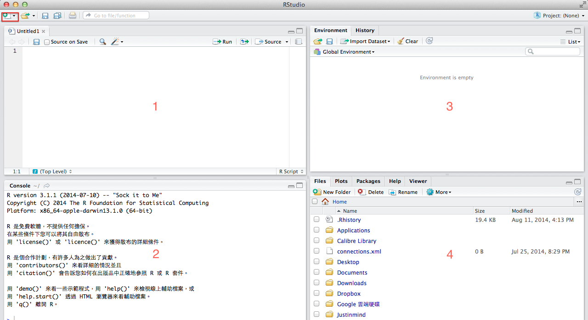

# Rstudio 基本介紹

### 簡介
RStudio 是一個 [IDE](http://zh.wikipedia.org/wiki/集成开发环境)，在作者剛開始學 R 的時候，其實並沒有 RStudio 只有 R 的 GUI 畫面，後來為了提高開發效率，這套工具才就此誕生。Rstudio 特點很多就不再一一贅述，用過了以後就會覺得哪裡好用了，尤其是針對以前用過 GUI 的人更是一大福音。

### 介面概況



+ Workspace (左上角)
+ Console (左下角)
+ Environment、History (右上角)
+ Files、Plots、Packages、Help、Viewer (右上角)

### Workspace
剛開啟時不會存在，可以在左上角有一個開啟新文件的 icon，選擇一個新的 R script 檔案，這邊主要是用來撰寫程式碼的部份。

### Console
用來執行程式碼的地方，在 Workspace 選取欲執行的程式碼，按下以下快捷鍵就會發現程式碼自動在 Console 執行完成。

|快捷鍵| Mac | Windows & Linux |
| ------------ || ------------ | ------------- |
|Run current line/selection| Command + Enter | Ctrl + Enter  |

### Environment、History
+ Environment：是用來記載目前變數的數值，方便查看目前變數的狀況。
+ History：是所有在 Consloe 執行過程式碼的歷史記錄。

### Files、Plots、Packages、Help、Viewer
+ Files：是讓使用者了解所在的工作環境是在哪個目錄，這個對讀取檔案非常重要。
+ Ploats：顯示使用者畫好的圖表。
+ Paackage：記錄目前已安裝的 Package，打勾代表已經載入，安裝 Package 請點選「Install」。
+ Help：查詢文件使用，在 Console 輸入 help()，() 輸入所要查詢方法的名稱，ex：help(sum)。
+ Viewer：是用來顯示網頁或 html file。

###  快捷鍵
請參考 [RStudio](https://support.rstudio.com/hc/en-us/articles/200711853-Keyboard-Shortcuts) 官方文件

### 調整 RStudio 的 Appearance 與 Pane layout。
點選右上角的 RStudio > Preferences 裡面的 Appearance 與 Pane Layout。
+ Appearance：可以調整字體、字體大小、Workspace 與 Console 的 theme。
+ Pane Layout：調整開啟畫面的左上、左下、右上、右下的內容，可以自動調整。

### 實際操作

1. 開啟一個新的 R script 檔案
2. 輸入程式碼(程式碼如下)
3. 利用快捷鍵在 Console 執行
4. 在 Environment 會發現 x、y 與 z 的值。

```r
x <- 3
y <- 4
z <- sum(x + y)
help(sum)
```

註：<- 是 R 的 assignment operator 用來賦與變數值所使用，像 x <- 3 代表 x 是 3，另外提醒一下，變數的大小寫是有差別的，代表兩個不同變數，ex：x 與 X

### 查詢函數的小技巧
+ 使用 help(函數名稱) 等同於 ?函數名稱
+ 使用 args(函數名稱) 得知函數參數有哪些
+ 使用 example(函數名稱)，ex：example(dim) 取得函數的使用範例，但是切記不是所有方法都有
+ 在 Console 輸入函數名稱後，按下 tab 鍵可以看到函數相關資訊

### 推薦查詢文件小工具

+ [Dash](http://kapeli.com/dash)：針對 Mac 使用者。
+ [Velocity](http://velocity.silverlakesoftware.com)：針對 Windows 使用者，聽說背後的文件來源是來自 Dash。

雖然以上兩個軟體都是要錢，可是保證可以大幅提升工作效率。
